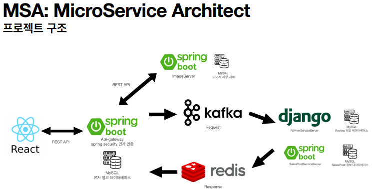

# 소상공인을 위한 마케팅 플랫폼

| 이름   | 역할   | 기타   |
| ------ | ------ | ------ |
| 오민규 | 백엔드 | Spring |
| 이민재 | 백엔드 | Django |
| 이종현 | 백엔드 | Spring |
| 이창의 | 백엔드 | Spring |
| 한동근 | 백엔드 | Spring |
| 김수환 | 프론트 | NextJS |

아이디어 설명: https://www.notion.so/40183cd70217443286e4be23a6c46f70?pvs=4

API 링크: https://www.notion.so/API-0d6d6a3d1366441684bb60328ebf7c64?pvs=4

프론트 실행 방법

> npm install

> npm run dev

### 사용한 개발 도구

>          

### 전체 구조

MSA를 활용한 유연한 확장성, 쉬운 유지보수를 노림

### 프로젝트 구현 화면  

#### 메인, 로그인
  

#### 판매 등록  
  

#### 등록 확인  
  

#### 홍보 게시판 등록  

